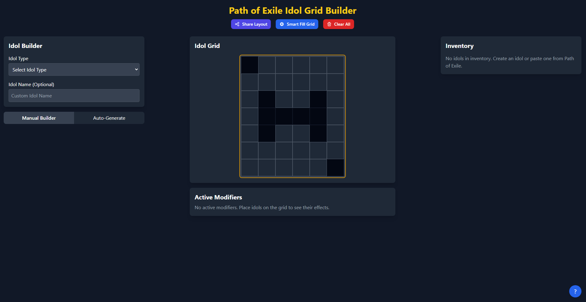

# Path of Exile Idol Grid Builder

A powerful web application for planning and optimizing your Idol layouts in Path of Exile. This tool helps you experiment with different idol combinations, maximize modifier stacking, and find the perfect arrangement for your build.



## Table of Contents
- [Features](#features)
- [Demo](#demo)
- [Installation](#installation)
- [Usage Guide](#usage-guide)
- [Development](#development)
- [Deployment](#deployment)
- [Contributing](#contributing)
- [License](#license)
- [Credits](#credits)

## Features

- **Interactive Idol Grid**: Drag and drop idols onto the grid with automatic validation
- **Custom Idol Builder**: Create any idol with your choice of prefixes and suffixes
- **Auto-Optimization**: Automatically arrange idols for maximum grid utilization
- **Modifier Search**: Find specific modifiers across all idol types
- **Modifier Stacking**: View combined effects of all active modifiers
- **Idol Generation**: Generate optimal idols based on desired modifiers
- **Import from Game**: Paste idols directly from Path of Exile (Ctrl+V)
- **Layout Sharing**: Share your grid layouts with others via URL
- **Persistent Storage**: Automatically saves your layouts between sessions
- **Mobile Friendly**: Responsive design works on all devices

## Demo

Check out the live demo: [PoE Idol Grid Builder](https://jlepoff.github.io/poe-idol-grid-builder/)

## Installation

### Prerequisites
- Node.js (v14+)
- npm or yarn

### Setup
1. Clone the repository:
   ```bash
   git clone https://github.com/jlepoff/poe-idol-grid-builder.git
   cd poe-idol-grid-builder
   ```

2. Install dependencies:
   ```bash
   npm install
   ```

3. Start the development server:
   ```bash
   npm start
   ```

4. Open [http://localhost:3000](http://localhost:3000) in your browser.

## Usage Guide

### Building Idols
1. Select an idol type (Minor, Kamasan, Totemic, Noble, Conqueror, or Burial)
2. Search for and add up to 2 prefixes and 2 suffixes
3. Click "Create Idol" to add it to your inventory

### Grid Placement
- Drag idols from your inventory to place them on the grid
- Primary cells show the first letter of the idol type
- Right-click to remove idols from the grid or inventory

### Layout Optimization
- Click "Smart Fill Grid" to automatically arrange your idols efficiently
- The algorithm tries to place as many idols as possible based on their modifiers

### Auto-Generate Idols
1. Go to the "Auto" tab
2. Add desired modifiers to your list (click multiple times for higher quantities)
3. Click "Generate & Place Idols" to create and place optimal idols with those modifiers

### Modifier Analysis
- View all active modifiers and their stacked effects
- Modifiers are grouped by name for easier reading

### Keyboard Shortcuts
- **Ctrl+V**: Paste an idol from Path of Exile
- **?**: Show keyboard shortcuts
- **Esc**: Close dialog windows

### Sharing Layouts
- Click the "Share Layout" button to copy a URL
- Anyone with the URL can load your exact layout

## Development

### Project Structure
```
poe-idol-grid-builder/
├── public/
│   ├── data/               # JSON data files for idol modifiers
│   ├── index.html          # HTML entry point
│   └── manifest.json       # Web app manifest
├── src/
│   ├── components/         # React components
│   ├── utils/              # Utility functions
│   ├── App.js              # Main application component
│   └── index.js            # JavaScript entry point
└── package.json            # Project dependencies and scripts
```

### Available Scripts
- `npm start`: Starts the development server
- `npm test`: Launches the test runner
- `npm run build`: Builds the app for production
- `npm run deploy`: Deploys the app to GitHub Pages

## Deployment

### GitHub Pages
1. Update `package.json` with your repository information:
   ```json
   "homepage": "https://yourusername.github.io/poe-idol-grid-builder"
   ```

2. Install GitHub Pages package:
   ```bash
   npm install gh-pages --save-dev
   ```

3. Deploy your application:
   ```bash
   npm run deploy
   ```

### Other Hosting Options
The app can be deployed to any static site hosting service:

1. Build the production version:
   ```bash
   npm run build
   ```

2. Upload the contents of the `build` directory to your hosting provider.

## License

This project is licensed under the MIT License - see the [LICENSE](LICENSE) file for details.

```
MIT License

Copyright (c) 2025 Your Name

Permission is hereby granted, free of charge, to any person obtaining a copy
of this software and associated documentation files (the "Software"), to deal
in the Software without restriction, including without limitation the rights
to use, copy, modify, merge, publish, distribute, sublicense, and/or sell
copies of the Software, and to permit persons to whom the Software is
furnished to do so, subject to the following conditions:

The above copyright notice and this permission notice shall be included in all
copies or substantial portions of the Software.

THE SOFTWARE IS PROVIDED "AS IS", WITHOUT WARRANTY OF ANY KIND, EXPRESS OR
IMPLIED, INCLUDING BUT NOT LIMITED TO THE WARRANTIES OF MERCHANTABILITY,
FITNESS FOR A PARTICULAR PURPOSE AND NONINFRINGEMENT. IN NO EVENT SHALL THE
AUTHORS OR COPYRIGHT HOLDERS BE LIABLE FOR ANY CLAIM, DAMAGES OR OTHER
LIABILITY, WHETHER IN AN ACTION OF CONTRACT, TORT OR OTHERWISE, ARISING FROM,
OUT OF OR IN CONNECTION WITH THE SOFTWARE OR THE USE OR OTHER DEALINGS IN THE
SOFTWARE.
```

## Credits

- Idol data from [meatwallace/idol-planner](https://github.com/meatwallace/idol-planner)
- Code assistance provided by [Claude 3.7 Sonnet](https://www.anthropic.com/claude)
---
