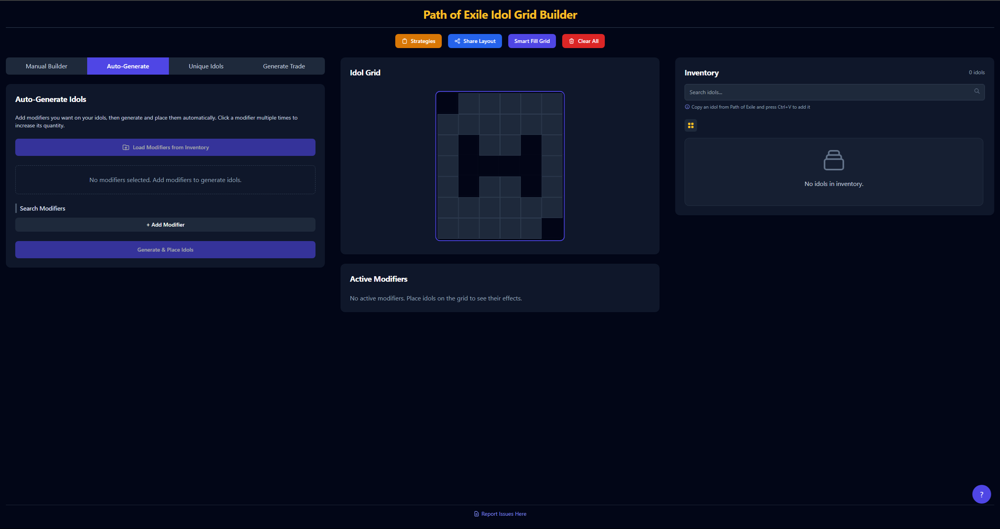

# Path of Exile Idol Grid Builder

A powerful web application for planning and optimizing your Idol layouts in Path of Exile. This tool helps you experiment with different idol combinations, maximize modifier stacking, and find the perfect arrangement for your build.



## Table of Contents
- [Features](#features)
- [Demo](#demo)
- [Usage Guide](#usage-guide)
- [Installation for Developers](#installation-for-developers)
- [Development](#development)
- [Deployment](#deployment)
- [License](#license)
- [Credits](#credits)

## Features

- **Interactive Idol Grid**: Drag and drop idols onto the grid with automatic validation
- **Trade Integration**: Quickly search for idols on the official Path of Exile trade site
- **Custom Idol Builder**: Create any idol with your choice of prefixes and suffixes
- **Auto-Optimization**: Automatically arrange idols for maximum grid utilization
- **Modifier Search**: Find specific modifiers across all idol types
- **Modifier Stacking**: View combined effects of all active modifiers
- **Idol Generation**: Generate optimal idols based on desired modifiers
- **Import from Game**: Paste idols directly from Path of Exile (Ctrl+V)
- **Layout Sharing**: Share your grid layouts with others via URL
- **Persistent Storage**: Automatically saves your layouts between sessions
- **Community Strategies**: Browse and load popular farming strategies
- **Unique Idols**: Browse and add unique idols with special modifiers
- **Trade Generator**: Create trade searches for specific modifier combinations
- **Export to Text**: Share your idol configuration in text format

## Demo

Check out the live demo: [PoE Idol Grid Builder](https://jlepoff.github.io/poe-idol-grid-builder/)

## Usage Guide

### Building Idols
1. Select an idol type (Minor, Kamasan, Totemic, Noble, Conqueror, or Burial)
2. Search for and add up to 2 prefixes and 2 suffixes
3. Click "Create Idol" to add it to your inventory

### Grid Placement
- Drag idols from your inventory to place them on the grid
- Primary cells show the first letter of the idol type (or "U" for uniques)
- Right-click to remove idols from the grid or inventory

### Layout Optimization
- Click "Smart Fill Grid" to automatically arrange your idols efficiently
- The algorithm tries to place as many idols as possible based on their modifiers

### Auto-Generate Idols
1. Go to the "Auto" tab
2. Add desired modifiers to your list (click multiple times for higher quantities)
3. Click "Generate & Place Idols" to create and place optimal idols with those modifiers
4. Optionally "Load Modifiers from Inventory" to extract mods from existing idols

### Community Strategies
1. Click "Strategies" button to browse community-created farming strategies
2. Select a strategy to load its idol configuration
3. The strategy's idols and layout will be automatically imported

### Unique Idols
1. Go to the "Unique Idols" tab to browse available unique idols
2. Click "Add" to add a unique idol to your inventory
3. Click "Trade" to search for the unique idol on the trade site

### Trade Generator
1. Go to the "Generate Trade" tab
2. Select an idol type and add modifiers you want on your idol
3. Click "Trade for Modifiers" to search for matching idols on the trade site

### Modifier Analysis
- View all active modifiers and their stacked effects in the "Active Modifiers" section
- Use "Export to Text" to share your configuration with others

### Keyboard Shortcuts
- **Ctrl+V**: Paste an idol from Path of Exile
- **?**: Show keyboard shortcuts
- **Esc**: Close dialog windows

### Sharing Layouts
- Click the "Share Layout" button to copy a URL
- Anyone with the URL can load your exact layout

## Installation for Developers

### Prerequisites
- Node.js (v14+)
- npm or yarn

### Setup
1. Clone the repository:
   ```bash
   git clone https://github.com/Jlepoff/poe-idol-grid-builder.git
   cd poe-idol-grid-builder
   ```

2. Install dependencies:
   ```bash
   npm install
   ```

3. Start the development server:
   ```bash
   npm start
   ```

4. Open [http://localhost:3000](http://localhost:3000) in your browser.

## Development

### Project Structure
```
poe-idol-grid-builder/
├── public/
│   ├── data/               # JSON data files for idol modifiers and strategies
│   ├── index.html          # HTML entry point
│   └── manifest.json       # Web app manifest
├── src/
│   ├── api/                # API and data loading functions
│   ├── components/         # React components
│   │   ├── builder/        # Idol builder components
│   │   ├── common/         # Reusable UI components
│   │   ├── grid/           # Grid and optimization components
│   │   ├── inventory/      # Inventory management components
│   │   ├── modifiers/      # Modifier search and display components
│   │   ├── strategies/     # Community strategies components
│   │   └── trade/          # Trade integration components
│   ├── context/            # React context providers
│   ├── hooks/              # Custom React hooks
│   ├── utils/              # Utility functions
│   │   ├── grid/           # Grid manipulation utilities
│   │   ├── idol/           # Idol generation utilities
│   │   ├── modifiers/      # Modifier processing utilities
│   │   ├── storage/        # Local storage and sharing utilities
│   │   └── trade/          # Trade site integration utilities
│   ├── App.js              # Main application component
│   ├── App.css             # Application styles
│   ├── index.js            # JavaScript entry point
│   └── index.css           # Global styles and Tailwind configuration
├── postcss.config.js       # PostCSS configuration
├── tailwind.config.js      # Tailwind CSS configuration
└── package.json            # Project dependencies and scripts
```

### Available Scripts
- `npm start`: Starts the development server
- `npm run build`: Builds the app for production
- `npm run deploy`: Deploys the app to GitHub Pages

## Deployment

### GitHub Pages
1. Update `package.json` with your repository information:
   ```json
   "homepage": "https://yourusername.github.io/poe-idol-grid-builder"
   ```

2. Install GitHub Pages package:
   ```bash
   npm install gh-pages --save-dev
   ```

3. Deploy your application:
   ```bash
   npm run deploy
   ```

### Other Hosting Options
The app can be deployed to any static site hosting service:

1. Build the production version:
   ```bash
   npm run build
   ```

2. Upload the contents of the `build` directory to your hosting provider.

## License

This project is licensed under the MIT License.

## Credits

- Initial idol data from [meatwallace/idol-planner](https://github.com/meatwallace/idol-planner)
- Thanks to all contributors and community members who have reported bugs and suggested improvements
- Built with [React](https://reactjs.org/), [Tailwind CSS](https://tailwindcss.com/), and [React DnD](https://react-dnd.github.io/react-dnd/)

---